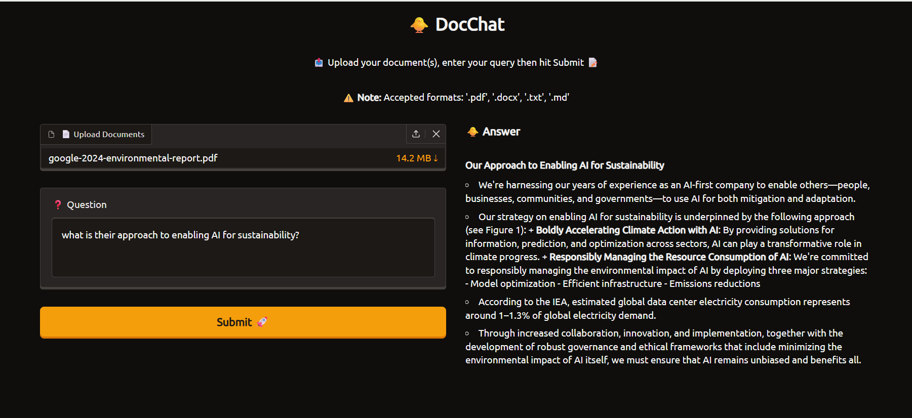

# 🐥 DocChat: RAG-Chatbot

**DocChat** is a Retrieval-Augmented Generation (RAG) chatbot that allows users to upload documents (PDF, DOCX, TXT, MD) and ask detailed questions about their content. It uses **ChromaDB** for vector storage and **Ollama (Llama 3.1)** for local LLM processing.

---

## 🚀 Features

- **Multi-Format Support**: Process PDF, Word, and text documents  
- **Local LLM**: Powered by Ollama for privacy and offline capability  
- **Real-time Streaming**: Answers appear word-by-word for a smooth experience  
- **Persistent Vector DB**: Uses ChromaDB to store and retrieve document embeddings efficiently  
- **High-Quality Retrieval**: Utilizes `all-mpnet-base-v2` for high-accuracy semantic search  

---

## 📸 Working




---

## 🛠️ Installation & Setup

### 1️⃣ Clone the Repository
```bash
git clone https://github.com/your-repo/docchat.git
cd docchat
```
2️⃣ Install Dependencies
```bash
pip install -r requirements.txt
```
3️⃣ Set Up Ollama

Install Ollama

Pull the Llama 3.1 model:
```bash
ollama pull llama3.1
```
4️⃣ Run the Application
```bash
gradio app.py
```
🏗️ Project Structure
- app.py           - Gradio web interface and session management
- processor.py     - File extraction, chunking, and embedding generation
- vector_search.py - ChromaDB querying and relevance filtering
- prompt_llm.py    - Prompt engineering and Ollama API communication

📄 Configuration

You can tune retrieval behavior in vector_search.py:

- RELEVANCE_THRESHOLD
Minimum similarity score for a document chunk to be considered
(Default: 0.05)

- top_k
Number of document chunks passed to the LLM
(Default: 5)
